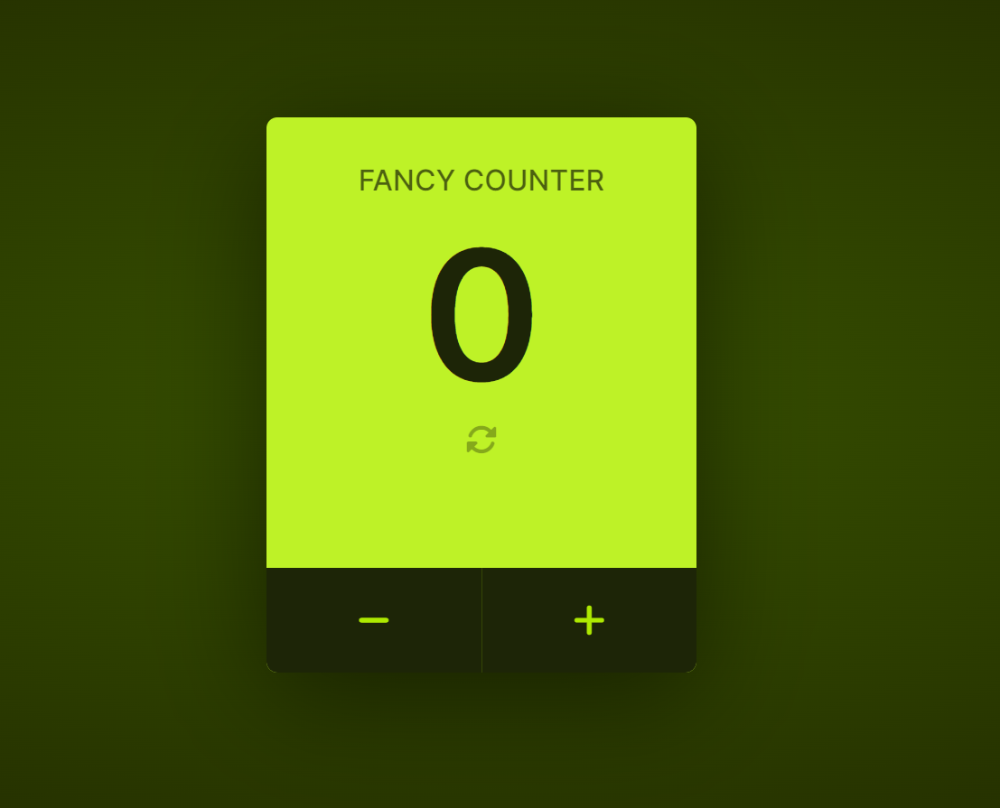

# Fancy Counter Application
## This application is built with HTML, CSS and Vanilla JavaScript(most important of all)
### This application do increase and decrease counter value by click buttons or by pressing the corresponding keyboard keys.

```
 If '+' button clicked increase counter value or pressed Numpad +, W or any of the up arrow keys
 If '-' button clicked decrease counter value of pressed Numpad -, S or any of the down arrow keys
 If clicked reset button, reset counter value
```

